# Text Classification

Text Classification is the task of assigning a label or class to a given text. Some use cases are sentiment analysis, natural language inference, and assessing grammatical correctness.


Stanford University has obtained characteristics of billions of words that have strange proportions. Click on the [link](https://nlp.stanford.edu/projects/glove/) to read more and download.

---

Using NLP, I want to classify the sentences and display a special emoji based on the emotion that the sentence evokes.

- Dataset

](assents/spaces_u_image.png)

- Network

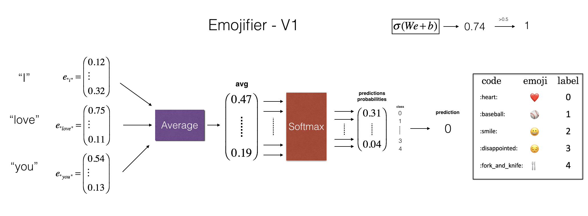

## How to install
```
pip install -r requirements.txt
```

## How to run
```
python Emoji_Text_Classification.py
```

## Accuracy and Loss

|Vectors|Accuracy|Loss|Accuracy plot|Loss plot|
|-------|--------|----|----|------|
|  50d  | 0.81   |0.6 |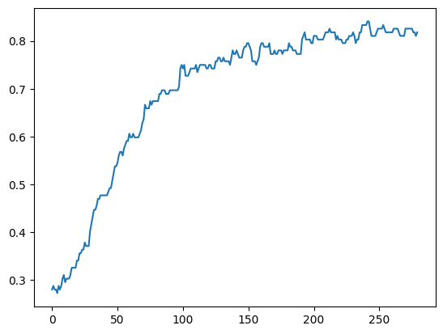|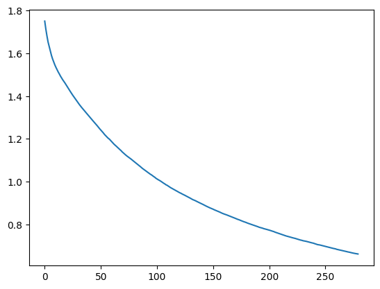|
| 100d  | 0.90   |0.4 |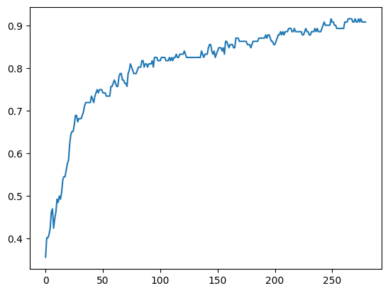|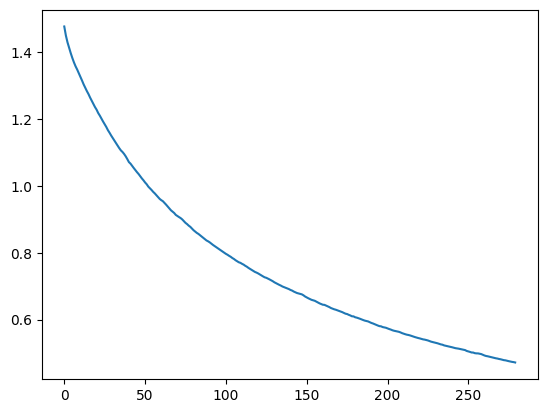|
| 200d  | 0.94   |0.2 |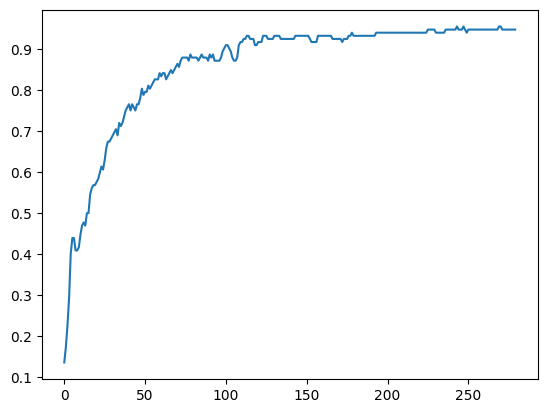|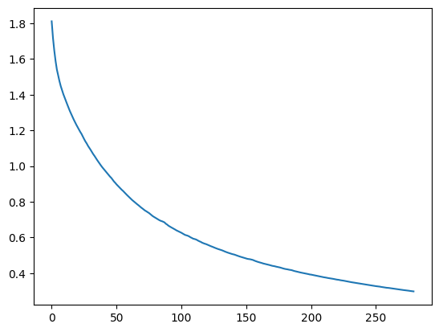|
| 300d  | 0.99   |0.1 |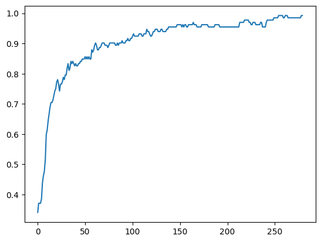|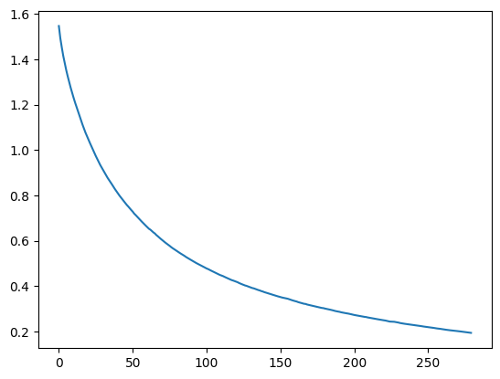 |

## Results
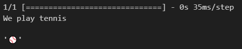
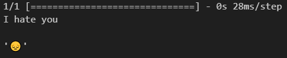
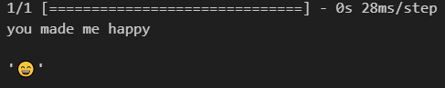
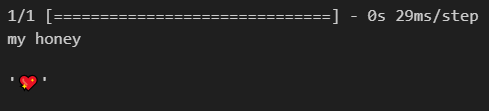